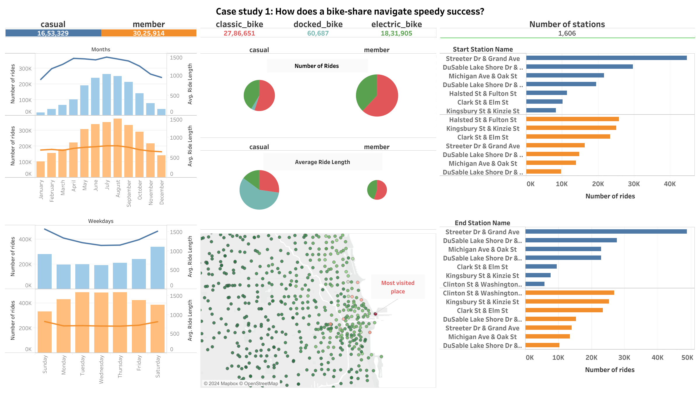

# Sparsh Gupta - Data Analysis Portfolio
## About
Hi, I'm Sparsh Gupta. I am MBA graduate with expertise in data analysis. Proficient in spreadsheets for data manipulation, SQL for database querying, R for statistical analysis, and Tableau for data visualization. Proven ability to derive insights and make data-driven decisions. Strong analytical skills combined with business acumen.

My CV in [**pdf**](https://drive.google.com/file/d/15oRNTMasIY8gJxBsstAP6kzFhOC_i-PR/view?usp=sharing).

This is a repository to showcase skills, share projects and track my progress in Data Analytics related topics.
## Table of Contents
- [About](#about)
- [Portfolio Projects](#portfolio-projects)
    - Python
    - R
        - [How does a bike-share navigate speedy success?](#how-does-a-bike-share-navigate-speedy-success)
    - SQL
    - Spreadsheets
    - Tableau [[**Link**](https://public.tableau.com/app/profile/sparsh.gupta6875/vizzes)]
    - Power BI
    - Power Point
    - Google Slides
    - Canva
- [Education](#education)
- [Certificates](#certificates)
- [Contact](#contact)
## Portfolio Projects
In this section I will list data analytics projects briefly describing the technology stack used to solve cases.

### How does a bike-share navigate speedy success?

**Kaggle Notebook**- [**Link**](https://www.kaggle.com/code/sparshgupta2109/how-does-a-bike-share-navigate-speedy-success)
#### Goal
Design marketing strategies aimed at converting casual riders into annual members.

#### Description
Cyclistic, a bike-share company in Chicago, seeks to maximize the number of annual memberships. The company aims to understand the different usage patterns of casual riders and annual members to design effective marketing strategies that convert casual riders into annual members. The analysis follows the steps of the data analysis process—Ask, Prepare, Process, Analyze, Share, and Act—to derive insights and recommendations.

#### Skills
- Data Analysis
- Statistical Analysis
- Data Visualization
- Marketing Strategy Design
- Customer Behavior Analysis

#### Technology
- Tidyverse (R package for data manipulation and visualization)
- ggplot2 (R package for creating complex plots from data)
- Tableau (for creating interactive visualizations and dashboards)
    - [**Link of Dashboard**](https://public.tableau.com/app/profile/sparsh.gupta6875/viz/Casestudy1Howdoesabike-sharenavigatespeedysuccess/Dashboard3)

#### Results
1. **Usage Patterns**:
   - Annual Members: Use bikes for regular commuting during peak hours on weekdays. Trips are shorter in duration and distance.
   - Casual Riders: Use bikes more for leisure and sporadic trips, primarily on weekends and holidays. Their trips are longer in duration but fewer in frequency.

2. **Revenue and Profitability**:
   - Annual members generate stable, predictable revenue and contribute more consistently to profitability compared to casual riders.

3. **Popular Stations**:
   - Casual riders frequently start and end their rides at Streeter Dr & Grand Ave.
   - 7.31% of casual riders and 3.08% of annual members have circular trips, indicating leisure rides.

4. **Seasonal Preferences**:
   - Both casual riders and annual members prefer riding during the summer, with peak usage from June to August.

5. **Bike Preferences**:
   - Both groups prefer classic bikes. Casual riders using docked bikes have the longest ride durations.

6. **Ride Distances**:
   - Similar ride distances between casual riders and annual members, with primary differences in frequency and duration of rides.

7. **Conversion Potential**:
   - Casual riders present a significant opportunity for conversion to annual memberships due to their existing engagement with the service.

8. **Digital Media Influence**:
   - Effective digital media campaigns can target casual riders with personalized offers and reminders, potentially increasing conversion rates through retargeting ads, social media promotions, and email marketing.

These insights inform the recommendations for tailored marketing campaigns, incentives, and offers, enhanced user experience, and leveraging digital media to boost annual membership conversions.

## Education
- **MBA** (*2021 - 2023*)

  USMS, GGSIPU

  Sector 16 C, Dwarka, New Delhi- 110078
  
- **BBA** (*2018 - 2021*)
  
  Tecnia Institute of Advance Studies, GGSIPU
  
  3, Bhagwan Mahavir Marg, Sector 14, Rohini, Delhi- 85
  
- **12th** (*2018*)

  S.D. Public School

  **Subject:** Commerce

  Balraj Khanna Marg, Delhi Patel Nagar, Delhi- 110008

## Certificates
- Google data analytics certifications
- Financial Accounting (NPTEL)

## Contact
- Linkedin: [@sparshgupta](https://www.linkedin.com/in/sparsh-gupta-21sep2000/)
- Email: sparshgupta2109@gmail.com
